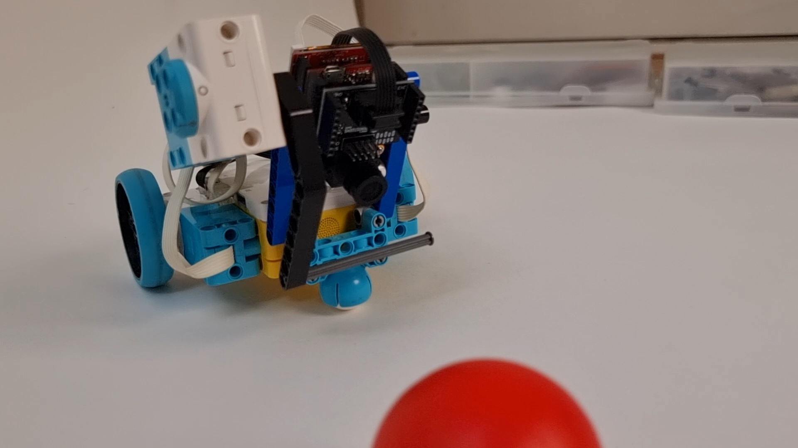

# SPIKE Prime ball kicker with OpenMV H7 camera

This project uses the OpenMV H7 camera to detect a ball and kick it with the SPIKE Prime robot. The OpenMV camera is connected to the SPIKE Prime via the SPIKE-OPENMV breakout board. The PUPRemote library makes the 
OpenMV camera act as a LEGO PoweredUp sensor. The SPIKE Prime program uses the PUPRemote library to read the sensor values and control the SPIKE Prime motors. In this case, it reads the blob size (number of pixels) and the blob's x and y coordinates. The SPIKE Prime program then uses these values to control the motors to kick the ball.

## Requirements

* [LEGO SPIKE Prime](https://education.lego.com/en-us/products/lego-education-spike-prime-set/45678)
* [SPIKE-OPENMV breakout board](https://www.antonsmindstorms.com/product/spike-smart-camera-breakout-board-spike-openmv/)
* [OpenMV H7 camera](https://openmv.io/products/openmv-cam-h7)
* LEGO Duplo ball. I used the one from the MINDSTORMS Robot Inventor set.

## Running the program

1. Copy `main.py`, `lpf2.py`, and `pupremote.py` to the OpenMV camera and reset the camera.
2. Install [Pybricks firmware](https://code.pybricks.com) on the SPIKE Prime.
3. Copy the contents of `pupremote.py` into a new Pybricks program with exactly that name.
4. Copy the contents of `pybricks_spike.py` into a new Pybricks program with exactly that name.
5. Press run inside the Pybricks editor to run the program.